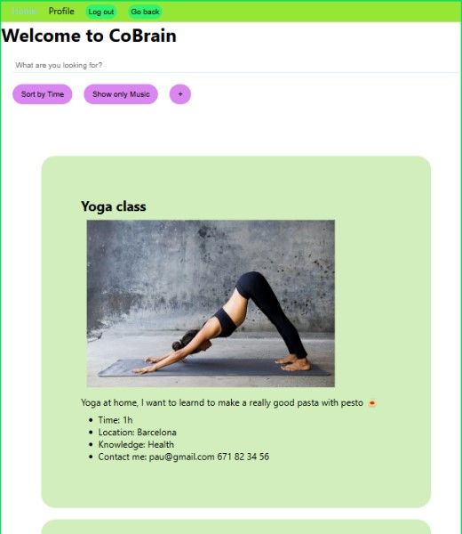

# CoBrain

## Description

This application is called CoBrain. It is used for exchange knowledge with time to create a better Society
[]()

---
## Instructions

When cloning the project, change the <code>sample.env</code> file name for <code>.env</code>. The project will run on **PORT 3000**.

Then, run:
```bash
npm install
```

To start the project run:
```bash
npm run start
```

---
## User stories 

### MVP

- User can sign up and create a new account
- User can login
- User can log out
- User can create a Knowledge.
- User can edit its Knowledge.
- User can delete its Knowledge.


### Backlog

- User can search for a category of Knowledge and location.
- User can see its vote history.
- User can filter Knowledge by Music.
- User can filter Knowledge by Time.

---

## Useful links

- [Presentation slides](https://slides.com/ricardmontfortromero/cobrain/edit)
- [Backend repository](https://github.com/RicardMontfort90/backend-template-m3)
- [Backend deploy](https://github.com/RicardMontfort90/backend-template-m3)
- [Deployed app](https://cobrain.netlify.app/)